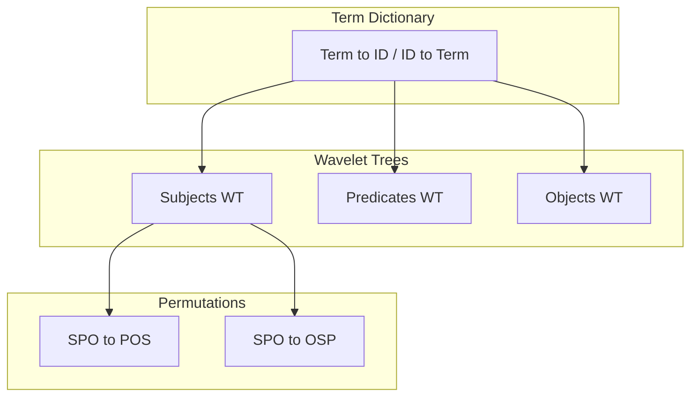

# Ring Index

The Ring Index is a compact representation for RDF triples that achieves approximately 3x space reduction compared to traditional hash-based triple indexing. It is inspired by the Ring data structure described by Alvarez-Garcia et al. for compressed RDF management, adapted for Grafeo's embeddable architecture.

**Feature flag:** `ring-index`

## Motivation

Traditional RDF stores maintain three separate hash indexes (SPO, POS, OSP) so that any triple pattern can be answered efficiently. This triplicates the storage cost. The Ring Index stores triples once and uses wavelet trees with succinct permutations to navigate between orderings, eliminating the redundancy.

| Approach | Size (1M triples) |
| -------- | ------------------ |
| 3 HashMaps | ~120 MB |
| Ring Index | ~40 MB |
| **Savings** | **~3x** |

## Architecture



### Term Dictionary

All RDF terms (IRIs, literals, blank nodes) are mapped to compact 32-bit integer IDs through a bidirectional dictionary. This dictionary is shared across all three components, so each unique term is stored exactly once.

```text
Term                          ID
<http://ex.org/alix>     -->  0
<http://xmlns.com/foaf/0.1/knows> --> 1
<http://ex.org/gus>      -->  2
"Alix"                   -->  3
```

### Wavelet Trees

Triples are sorted in SPO (subject, predicate, object) order. Three parallel wavelet trees store the subject, predicate, and object ID sequences respectively. Wavelet trees support two key operations in O(log sigma) time, where sigma is the alphabet size (number of distinct terms):

- **rank(v, i):** count occurrences of value v up to position i
- **select(v, k):** find the position of the k-th occurrence of value v

These operations enable efficient counting and lookup for any single-component pattern without scanning the full dataset.

### Succinct Permutations

Two permutations map positions between triple orderings:

- **SPO to POS:** maps a position in subject-predicate-object order to its position in predicate-object-subject order
- **SPO to OSP:** maps a position in subject-predicate-object order to its position in object-subject-predicate order

Each permutation stores both forward and inverse mappings for O(1) access, using 8n bytes for n triples. Together with the wavelet trees, this allows answering queries in any ordering without duplicating triple data.

## Query Patterns

The Ring Index supports all eight triple patterns:

| Pattern | Bound | Method |
| ------- | ----- | ------ |
| `???` | None | Return total count or iterate all |
| `S??` | Subject | Wavelet tree rank/select on subjects |
| `?P?` | Predicate | Wavelet tree rank/select on predicates |
| `??O` | Object | Wavelet tree rank/select on objects |
| `SP?` | Subject + Predicate | Find S positions, check P at each |
| `S?O` | Subject + Object | Find S positions, check O at each |
| `?PO` | Predicate + Object | Find P positions, check O at each |
| `SPO` | All | Exact match check |

Single-component patterns (S??, ?P?, ??O) are answered directly by wavelet tree `count()` in O(log sigma) time. The fully unbound pattern returns the stored triple count in O(1).

## Leapfrog Joins (WCOJ)

For qualified SPARQL queries with multiple triple patterns sharing variables,
the Ring Index supports leapfrog worst-case optimal joins (WCOJ). Instead of
materializing intermediate results through pairwise hash joins, the native path
prepares query-local canonical tries and intersects their sorted domains.

### How It Works

Consider a query like:

```sparql
SELECT ?person ?name ?friend WHERE {
  ?person :name ?name .
  ?person :knows ?friend .
}
```

This is a star join on `?person`. The native join:

1. Compiles query variables to compact IDs and each Ring term to one canonical
   RDF identity ID, while preserving the exact source term separately.
2. Builds one immutable lexicographic trie relation per triple pattern. Repeated
   positions are checked before insertion and every physical witness is retained
   at its canonical leaf.
3. Runs an iterative Leapfrog Triejoin cursor with complete backtracking.
4. Streams the Cartesian product of leaf witnesses, preserving SPARQL bag
   multiplicity, and materializes visible, exact, and identity values from one
   deterministic representative owner.

Preparation currently canonicalizes D dictionary terms, inspects the Ring once
per admitted pattern, and builds ordered matching leaves:
O(D + PN + sum(Mi log Mi)) time and O(D + sum(Mi)) query-local memory for P
patterns, N Ring rows, and Mi matches for relation i. Enumeration has the LFTJ
worst-case-optimal bound plus the emitted witness product Z; completed rows are
never collected eagerly.

### When the Planner Uses Leapfrog

Native selection is restored for a deliberately narrow, proved subset:

1. The `ring-index` feature is enabled and the store has a fresh Ring snapshot.
2. The multi-way join has at least three plain default-graph `TripleScan` inputs,
   with no chained input or transactional overlay.
3. Typed join metadata is non-empty, unique, exhaustive for the actual public
   overlaps, and consists only of same-name `RdfTermIdentity` conditions.
4. The query does not require the separate `LANG()`, `LANGMATCHES()`, or
   `DATATYPE()` companion columns.

The fourth condition exists because the leapfrog operator can emit visible,
lossless exact-term, and canonical identity-key columns, but it does not emit
the separate `LANG()`/`DATATYPE()` companion columns. Queries needing those
companions fall back to cascading pairwise hash joins with cardinality-based
ordering.

Graph/dataset scopes, transactions, stale or absent Ring snapshots, non-plain
MultiWayJoin input subtrees (including owned-normalization Filter/Project
wrappers), compatibility or mixed key semantics, and other unproved shapes
deliberately retain the typed cardinality-ordered hash fallback. Outer
row-preserving Project/Return operators may still consume a native join.
The core enumerator enforces repeated positions, but translated shapes that need
an owned normalization wrapper also remain on that fallback until it can be
fused without changing semantics.

A hand-built raw `TripleScan` that repeats one variable across scan positions is rejected
before planning; it must first be normalized to distinct internal positions
plus Filter/Project. Translated repeated-variable patterns already use that
correct wrapper form.

The admitted subset is covered by adversarial native-versus-fallback parity for
dead continuations, every closing continuation, witness-product bags, repeated
positions, language identity, xsd:string identity, IRI/literal collisions,
dictionary and pattern orders, LIMIT, OFFSET/ORDER BY, COUNT, and stale-Ring
fallback. See the in-tree Ring and RDF query tests for executable cases.

## Planner Integration

The Ring Index integrates with the query planner at two levels:

### Fast COUNT Paths

For ordinary single-symbol partially-bound triple patterns, the planner calls
`ring.count(&pattern)` to get exact cardinality in O(log sigma) time. Canonical
language-tag matching may inspect matching witnesses because the dictionary
also preserves the lossless source spelling.

```text
// Without Ring: estimate from RdfStatistics
cardinality = stats.estimate_triple_pattern_cardinality(true, Some(":knows"), false)
// Returns 10.0 (default estimate)

// With Ring: exact count via wavelet tree
cardinality = ring.count(&TriplePattern::new(Some(person), Some(knows), None))
// Returns 847 (exact)
```

### Cost-Based Join Fallback

When leapfrog is not applicable, the planner still benefits from Ring-derived cardinalities. It sorts inputs by ascending cardinality and folds them left-to-right with pairwise hash joins, ensuring the smallest intermediate results build first.

Native and fallback execution share that same stable cardinality order for
representative ownership, output schema, and physical types. Rebuilding or
invalidating the Ring therefore cannot change which canonical-equivalent source
term is exposed.

Canonical-equivalent physical statements remain distinct witnesses until RDF
graph membership/statement incarnation performs set normalization. Ring
enumeration intentionally does not discard those lossless physical witnesses.

The core API accepts a cooperative work guard, checks it through preparation
and enumeration, and makes a cancelled state terminal (restart with a fresh
state). The RDF physical operator currently supplies an unbounded guard;
production query-deadline cancellation during a first-pull Ring preparation is
not yet wired and is not claimed here.

Because native inputs are fused into the query-local tries rather than separate
physical scan operators, EXPLAIN ANALYZE shows structural `RdfRingTrieInput`
children explicitly labelled `stats unavailable, time in parent`. Preparation
time is charged to the parent `RdfLeapfrog` entry; scanned/matched input-row
counts are not currently exposed, so the structural children remain at zero.

## Persistence

The Ring Index implements the `Section` trait for `.grafeo` container persistence:

| Property | Value |
| -------- | ----- |
| Section type | `RdfRing` |
| Version | 1 |
| Encoding | bincode (standard config) |
| Dirty tracking | Atomic boolean, set on rebuild/invalidation |

On save, the complete state (term dictionary, wavelet trees, permutations) is serialized to bytes. On load, structural invariants are validated: wavelet tree lengths must match `num_triples`, permutation arrays must be valid permutations, and the term dictionary must be internally consistent. This prevents panics from corrupted data.

## Memory Characteristics

The Ring Index tracks its own memory usage through `size_bytes()`, which sums:

- Term dictionary (bidirectional hash map + term storage)
- Three wavelet trees (subject, predicate, object sequences)
- Two permutation arrays (SPO to POS, SPO to OSP)

The buffer manager includes Ring memory in its unified memory budget. When the Ring is loaded from a persisted section, no rebuild from triples is needed, avoiding the O(n log n) construction cost on restart.

## References

- Alvarez-Garcia et al., "Compressed Vertical Partitioning for Efficient RDF Management"
- MillenniumDB Ring implementation
